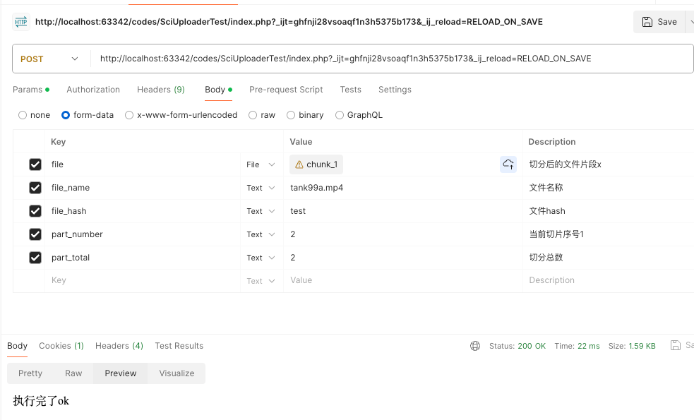

## 文件上传工具类

<h1 align="center">sci-uploader</h1>
<p align="center">:rainbow:文件上传组件。</p>


### 介绍
1. 支持文件分片上传
2. 支持服务器文件存储；通过实现FileStorage接口，可自定义文件存储方式
3. 支持文件秒传、分片断点续传

### 安装

```php
composer require chenshuai1993/sci-uploader -vvv
```

### 使用

```php
curl --location 'http://localhost:63342/codes/SciUploaderTest/index.php?_ijt=ghfnji28vsoaqf1n3h5375b173&_ij_reload=RELOAD_ON_SAVE' \
--header 'Cookie: Phpstorm-882e4b99=9270011a-ce9c-46c9-ad5e-aaf5038df465' \
--form 'file=@"/Users/cs/Documents/chenshuai/sci/codes/SciUploaderTest/chunks/chunk_1"' \
--form 'file_name="tank99a.mp4"' \
--form 'file_hash="test"' \
--form 'part_number="2"' \
--form 'part_total="2"'
```



```php
use Chenshuai1993\SciUploader\FileStorage;
use Chenshuai1993\SciUploader\MultiPartUpload;

//前端表单字段使用 file
$fileName = $_POST['file_name']; //文件名称
$fileHash = $_POST['file_hash']; //文件哈希值
$partNumber = $_POST['part_number']; //分片号
$partTotal = $_POST['part_total'];  //分片总数

$uploadDir ='./upload';  //文件上传路径
$storageDir ='./storage'; //文件存储路径
$uploader = new MultiPartUpload(new FileStorage($uploadDir, $storageDir));
try {
    //文件切片上传
    $uploader->uploadPart($fileName, $fileHash, $partNumber);
    $count = $uploader->countParts($fileName, $fileHash);
    if ($count == $partTotal){
        $uploader->mergePartsToFile($fileName, $fileHash, $partTotal);
        $uploader->completeMultipartUpload(function (){
            //这里有个闭包函数、执行完成后的操作
            echo '所有的切片都执行完了';
        });
    }

    ##其他
    //秒传验证文件是否已上传
    $resp = $uploader->getFileByHash($fileHash);
    //Array ( [file] => ./upload/test/tank99a.mp4 ) || Array ( )

    //删除上传文件
    $resp = $uploader->deleteFileByHash($fileHash);
    //true || false
} catch (Exception $e) {
    print_r($e->getCode());
    print_r($e->getMessage());die;
}

```